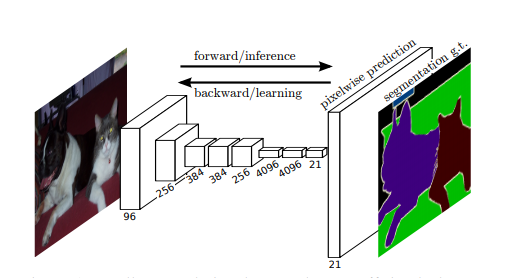

## Sematic_Segmentation_Using_Pytorch
Semantic segmentation using FCN. The model has been already been trained on PASCAL VOC dataset.
### Reference Paper:-  
1. https://arxiv.org/pdf/1411.4038.pdf  

